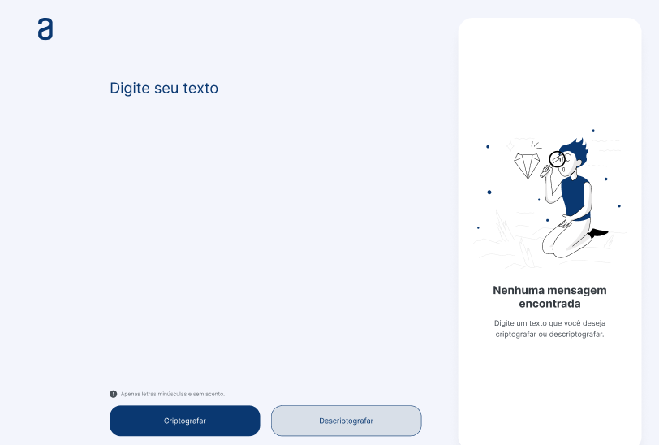
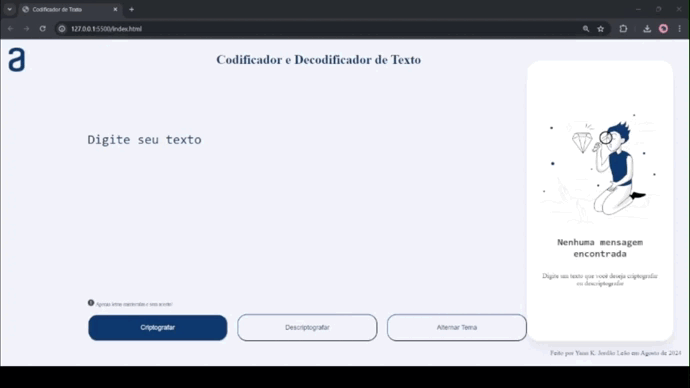

# Challenge - ONE - Turma 7: Codificador de Texto

  

## 🎯 Objetivos

O desafio proposto foi uma excelente oportunidade para consolidar o aprendizado nos cursos de Lógica de Programação, HTML, e CSS da plataforma Alura. O principal objetivo era desenvolver um **Codificador de Texto** em JavaScript, com interface gráfica em HTML e CSS, capaz de criptografar e descriptografar textos.

### 🔑 Chaves de Criptografia

O codificador substitui vogais específicas por combinações de letras:

- "a" é convertida em "ai"
- "e" é convertida em "enter"
- "i" é convertida em "imes"
- "o" é convertida em "ober"
- "u" é convertida em "ufat"

### 🔄 Exemplo de Uso

- **Entrada**: "tabuleiro"
- **Criptografado**: "taibufatlenterimesrober"
- **Descriptografado**: "tabuleiro"

### 📋 Regras Implementadas

- O texto deve conter apenas letras minúsculas.
- Não é permitido o uso de acentos ou caracteres especiais.

## 💡 Solução Proposta

Seguindo o design fornecido, desenvolvi uma aplicação que cumpre todas as especificações e adicionei algumas melhorias.

  

## 🚀 Resultado

Esta foi minha primeira experiência prática com HTML, CSS e JavaScript, e estou muito satisfeito com o resultado final. O design original foi respeitado, mas acrescentei algumas funcionalidades extras para melhorar a experiência do usuário.

[💻 Experimente o projeto online](https://yannknnay.github.io/Codificador-de-texto/)

  

### 🌟 Funcionalidades Adicionais

- **Alternância de Tema**: O usuário pode escolher entre cinco temas diferentes (Padrão, Dark, Coffe, Natura e Sea).
- **Validação de Entrada**: Exibe uma mensagem de erro caso o usuário insira letras maiúsculas ou com acentos.
- **Confirmação de Ação**: Mostra uma mensagem de sucesso quando o texto é copiado.

## 👨‍💻 Desenvolvedor

Este projeto foi desenvolvido por **Yann Leão** em agosto de 2024.
